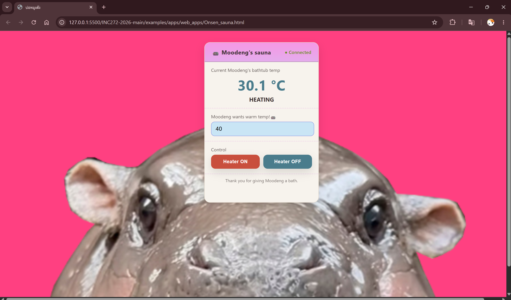

# Moodeng-s-Sauna

## Group Information

| | |
|---|---|
| Group name | |
| Member 1 | Jiraprapha Kwankla 67070504002 |
| Member 2 | Watcharaporn Pengsri 67070504011 |
| Member 3 | Sujira Chokjaraskij 6070504013 |
| Course | INC272: Web-Based IoT Applications (2026) |

* * *

## Project Goal

The project is a web-based temperature monitoring and heater control simulator for “Moodeng’s Sauna.”
 Its main goal is to demonstrate how an operator can:
- Monitor real-time temperature
- Control a heater remotely
- Set a desired target temperature
- Receive alerts when unsafe temperatures occur
- Observe system connection status

* * *

## Simulator Features Used

Check every feature your project actually uses. **At least 2 features are required.**

- [ ] LED — 4 channels, toggle on/off
- [ ] PSW — 4 push switches, read state
- [X] ADC — 4 analog channels, read sensor values
- [X] PWM — 4 channels, control duty ratio

* * *

## Interface Features

### Monitoring Elements

List each element that reads and displays data from the simulator.

| Element | What It Shows | Simulator Feature |
|---------|--------------|-------------------|
| Current Temperature | Live simulated temperature update every second | Live simulated temperature update every second |
| Heater Status | Shows "HEATING" (ON) or "PERFECT" (OFF) | Logic State |
| Connection Status | Shows "Connected" or "Disconnected" | Math.random() Sim |
| Alert Banners | Shows warnings for "Too Hot" ($>60^{\circ}C$) or "Too Cold" ($<28^{\circ}C$)  | Safety Check |

### Control Elements

List each element that sends a command to the simulator.

| Element | What It Does | Command Sent |
|---------|-------------|--------------|
| Heater ON Button | Starts increasing temperature toward target | heaterOn = true |
| Heater OFF Button | Stops heating; temperature cools toward $25^{\circ}C$ ambient  | heaterOn = false |
| Target Input | Allows user to enter a desired setpoint | targetTemp update |

* * *

## How to Run

1. Start the mock hardware server:
   ```bash
   cd simulator/mock-hardware-server
   npm start
   ```
2. Open `Onsen_sauna.html` using VS Code Live Server.
3. Check the browser console — a WebSocket connection message should appear.
4. Check the server terminal — `[CONNECT]` should be printed.

* * *

## File Structure

```
project-folder/
├── Onsen_sauna.html  — Main dashboard containing the UI layout, styling, and application logic
└── README.pdf        — Project documentation covering the goal, workflows, temperature simulation formulas, and safety alert thresholds
```

* * *

## Known Limitations

- Simulated connectivity: The connection status drops randomly every 5 seconds to simulate unstable IoT conditions.
- Alert spam prevention: Popups are restricted from repeating automatically to avoid notification spam.

* * *

## Screenshots


